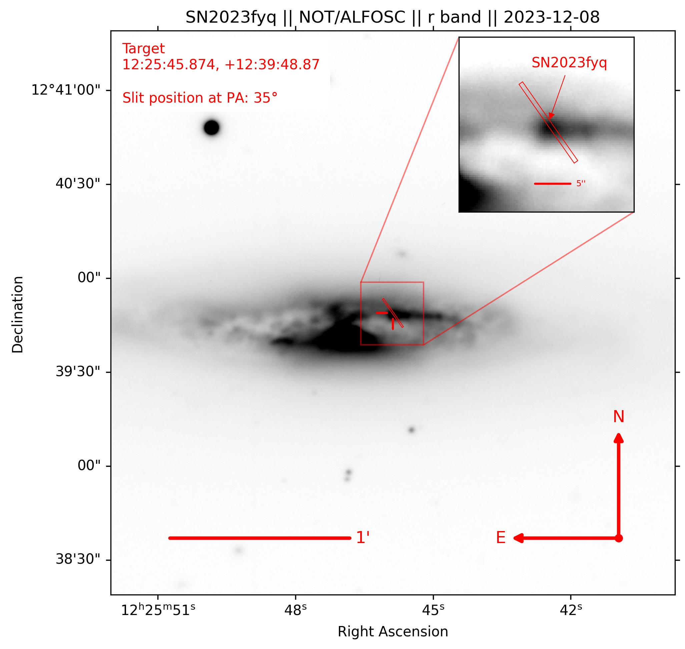

[arxiv_link_SN2023fyq]: https://arxiv.org/abs/2401.15148


# create_finder_chart.py

This is a relatively simple code using Astropy to produce a science-ready finder chart to be used for transient identification. The code will take a standard FITS image, align the image to celestial North, and annotate and highlight a given source.

## Usage

To produce your own finder chart - edit the following block of code in create_finder_chart.py. The following code was used when producing a finder chart used in the follow-up of [SN2023fyq](arxiv_link_SN2023fyq).

```python
# For the filename and will be used as a label when pointing out the transient
tname = 'SN2023fyq'

# The title of the figure
title_name = 'SN2023fyq || NOT/ALFOSC || r band || 2023-12-08'

# Where your file is - WCS must be correct in the file's header
fpath = '/home/seanbrennan/Desktop/SN2023fyq/images/NOT_ALFOSC/ZTF22abzzvln_NOT_ALFOSC_20231208_r_SDSS_wcs.fits'

# The location you are saving it to
saveloc = '/home/seanbrennan/Desktop/finder_charts/github'

# Ra and Dec in degrees of the target
ra, dec = 186.441143074, +12.6635758235

# Size of image in arcminutes
cutsize = 3

# Size of scale bar in arcminutes
scalebar = 1

# Size of cutout in arcseconds
inset_cutsize = 8

# Size of cutout in arcseconds
inset_scalebar = 3

# Lower and upper percentile values used for vmin, vmax when plotting the image
# Adjust values to improve contrast
vmin, vmax = 0.5, 99.5
```


## Output

An example of the output of *create_finder_chart.py* is given in Figure. 1

<p align="center">
  
  <br>
  <em>Figure 1.</em>
</p>
